# Mantra Theme Tech Tree Visualization

## Tech Tree Structure

```mermaid
graph TD
    %% Tier 0: Foundation
    T0[Tier 0: Foundation - Choose 2 Free]
    T0 --> suggestibility[Suggestibility]
    T0 --> acceptance[Acceptance]
    T0 --> focus[Focus]
    T0 --> relaxation[Relaxation]
    
    %% Tier 1: Core Paths
    T1[Tier 1: Core Paths - Level 5 + 200 CT each]
    
    %% Mental Path
    suggestibility --> brainwashing[Brainwashing]
    suggestibility --> conditioning[Conditioning]
    focus --> brainwashing
    focus --> conditioning
    
    %% Identity Path
    acceptance --> bimbo[Bimbo]
    acceptance --> good_girl[Good Girl]
    
    %% Submission Path
    acceptance --> obedience[Obedience]
    acceptance --> service[Service]
    
    %% Sensation Path
    relaxation --> pleasure[Pleasure]
    relaxation --> arousal[Arousal]
    
    %% Tier 2: Specializations
    T2[Tier 2: Specializations - Level 10 + 500 CT each]
    
    %% Mental Specializations
    brainwashing --> mindmelt[Mindmelt]
    brainwashing --> confusion[Confusion]
    brainwashing --> amnesia[Amnesia]
    conditioning --> intelligence_play[Intelligence Play]
    conditioning --> confusion
    
    %% Identity Specializations
    bimbo --> doll[Doll]
    bimbo --> pet[Pet]
    good_girl --> pet
    good_girl --> latex[Latex]
    
    %% More Identity Options
    conditioning --> drone[Drone]
    
    %% Submission Specializations
    obedience --> worship[Worship]
    obedience --> slave[Slave]
    service --> servant[Servant]
    service --> property[Property]
    
    %% Sensation Specializations
    pleasure --> edging[Edging]
    pleasure --> sensitivity[Sensitivity]
    arousal --> overstimulation[Overstimulation]
    arousal --> numbness[Numbness]
    
    %% Tier 3: Advanced
    T3[Tier 3: Advanced - Level 20 + 1,000 CT each]
    
    %% Mental Advanced
    mindmelt --> ego_loss[Ego Loss]
    mindmelt --> mindbreak[Mindbreak]
    confusion --> blank[Blank]
    amnesia --> loop[Loop]
    intelligence_play --> blank
    
    %% Mixed Advanced
    slave --> dehumanization[Dehumanization]
    property --> free_use[Free Use]
    doll --> dehumanization
    drone --> timestop[Timestop]
    
    %% Addiction requires multiple paths
    pleasure --> addiction[Addiction]
    arousal --> addiction
    worship --> addiction
    
    %% Tier 4: Extreme
    T4[Tier 4: Extreme - Level 30 + 2,500 CT each]
    
    ego_loss --> void[Void]
    mindbreak --> catharsis[Catharsis]
    blank --> internal_voice[Internal Voice]
    addiction --> stockholm[Stockholm]
    dehumanization --> corruption[Corruption]
    loop --> gaslighting[Gaslighting]
    
    %% Tier 5: Prestige
    T5[Tier 5: Prestige - Level 50 + 5,000 CT each]
    
    void --> transcendence[Transcendence]
    catharsis --> metamorphosis[Metamorphosis]
    internal_voice --> singularity[Singularity]
    gaslighting --> quantum[Quantum]
    
    %% Style different tiers
    classDef tier0 fill:#4CAF50,stroke:#333,stroke-width:2px,color:#fff
    classDef tier1 fill:#2196F3,stroke:#333,stroke-width:2px,color:#fff
    classDef tier2 fill:#9C27B0,stroke:#333,stroke-width:2px,color:#fff
    classDef tier3 fill:#FF9800,stroke:#333,stroke-width:2px,color:#fff
    classDef tier4 fill:#F44336,stroke:#333,stroke-width:2px,color:#fff
    classDef tier5 fill:#FFD700,stroke:#333,stroke-width:3px,color:#000
    
    class suggestibility,acceptance,focus,relaxation tier0
    class brainwashing,conditioning,bimbo,good_girl,obedience,service,pleasure,arousal tier1
    class mindmelt,confusion,amnesia,intelligence_play,doll,pet,drone,latex,worship,servant,slave,property,edging,overstimulation,sensitivity,numbness tier2
    class ego_loss,mindbreak,blank,loop,addiction,dehumanization,free_use,timestop tier3
    class void,catharsis,internal_voice,stockholm,corruption,gaslighting tier4
    class transcendence,metamorphosis,singularity,quantum tier5
```



## Simplified Path View

### Mental Development Path
```
Suggestibility/Focus → Brainwashing/Conditioning → Mindmelt/Confusion → Ego Loss/Mindbreak → Void/Catharsis → Transcendence
```

### Identity Transformation Path
```
Acceptance → Bimbo/Good Girl → Doll/Pet → Dehumanization → Corruption → Metamorphosis
```

### Submission Deepening Path
```
Acceptance → Obedience/Service → Worship/Slave → Free Use/Addiction → Stockholm → Quantum
```

### Sensation Exploration Path
```
Relaxation → Pleasure/Arousal → Edging/Sensitivity → Addiction → Gaslighting → Singularity
```

## Implementation Requirements

### 1. Theme Prerequisites Structure
```python
THEME_PREREQUISITES = {
    # Tier 1
    "brainwashing": ["suggestibility", "focus"],
    "conditioning": ["suggestibility", "focus"],
    "bimbo": ["acceptance"],
    "good_girl": ["acceptance"],
    "obedience": ["acceptance"],
    "service": ["acceptance"],
    "pleasure": ["relaxation"],
    "arousal": ["relaxation"],
    
    # Tier 2
    "mindmelt": ["brainwashing"],
    "confusion": ["brainwashing", "conditioning"],
    "amnesia": ["brainwashing"],
    "intelligence_play": ["conditioning"],
    "doll": ["bimbo"],
    "pet": ["bimbo", "good_girl"],
    "drone": ["conditioning"],
    "latex": ["good_girl"],
    "worship": ["obedience"],
    "servant": ["service"],
    "slave": ["obedience"],
    "property": ["service"],
    "edging": ["pleasure"],
    "overstimulation": ["arousal"],
    "sensitivity": ["pleasure"],
    "numbness": ["arousal"],
    
    # Tier 3
    "ego_loss": ["mindmelt"],
    "mindbreak": ["mindmelt"],
    "blank": ["confusion", "intelligence_play"],
    "loop": ["amnesia"],
    "addiction": ["pleasure", "arousal", "worship"],
    "dehumanization": ["slave", "doll"],
    "free_use": ["property"],
    "timestop": ["drone"],
    
    # Tier 4
    "void": ["ego_loss"],
    "catharsis": ["mindbreak"],
    "internal_voice": ["blank"],
    "stockholm": ["addiction"],
    "corruption": ["dehumanization"],
    "gaslighting": ["loop"],
    
    # Tier 5
    "transcendence": ["void"],
    "metamorphosis": ["catharsis"],
    "singularity": ["internal_voice"],
    "quantum": ["gaslighting"]
}
```

### 2. Level Requirements
```python
THEME_LEVEL_REQUIREMENTS = {
    # Tier 0: No requirements
    "suggestibility": 0,
    "acceptance": 0,
    "focus": 0,
    "relaxation": 0,
    
    # Tier 1: Level 5
    "brainwashing": 5,
    "conditioning": 5,
    "bimbo": 5,
    # ... etc
    
    # Tier 2: Level 10
    "mindmelt": 10,
    "confusion": 10,
    # ... etc
    
    # Tier 3: Level 20
    "ego_loss": 20,
    # ... etc
    
    # Tier 4: Level 30
    "void": 30,
    # ... etc
    
    # Tier 5: Level 50
    "transcendence": 50,
    # ... etc
}
```

### 3. Currency Costs
```python
THEME_COSTS = {
    # Tier 0: Free
    "suggestibility": 0,
    "acceptance": 0,
    "focus": 0,
    "relaxation": 0,
    
    # Tier 1: 200 CT
    "brainwashing": 200,
    "conditioning": 200,
    # ... etc
    
    # Tier 2: 500 CT
    "mindmelt": 500,
    # ... etc
    
    # Tier 3: 1,000 CT
    "ego_loss": 1000,
    # ... etc
    
    # Tier 4: 2,500 CT
    "void": 2500,
    # ... etc
    
    # Tier 5: 5,000 CT
    "transcendence": 5000,
    # ... etc
}
```

## Visual Command Ideas

### `/mantra tree` - Show Personal Progress
```
Your Theme Progress Tree:

Foundation (2/4 unlocked):
✅ Suggestibility     ✅ Acceptance
🔒 Focus              🔒 Relaxation

Core Paths (1/8 unlocked):
✅ Brainwashing (from Suggestibility)
🔓 Conditioning (200 CT) - Available!
🔓 Bimbo (200 CT) - Available!
🔓 Obedience (200 CT) - Available!
🔒 Good Girl - Requires Level 5
🔒 Service - Requires Level 5
🔒 Pleasure - Requires Relaxation
🔒 Arousal - Requires Relaxation

Next Unlock: Conditioning (200 CT)
Your Balance: 350 CT
```

### `/mantra paths` - Show Available Paths
```
Available Development Paths:

🧠 MENTAL PATH
Suggestibility → Brainwashing → Mindmelt → Ego Loss → Void

🎭 IDENTITY PATH  
Acceptance → Bimbo → Doll → Dehumanization → Corruption

⛓️ SUBMISSION PATH
Acceptance → Obedience → Slave → Free Use → Stockholm

💫 SENSATION PATH
[Locked - Requires Relaxation]
```